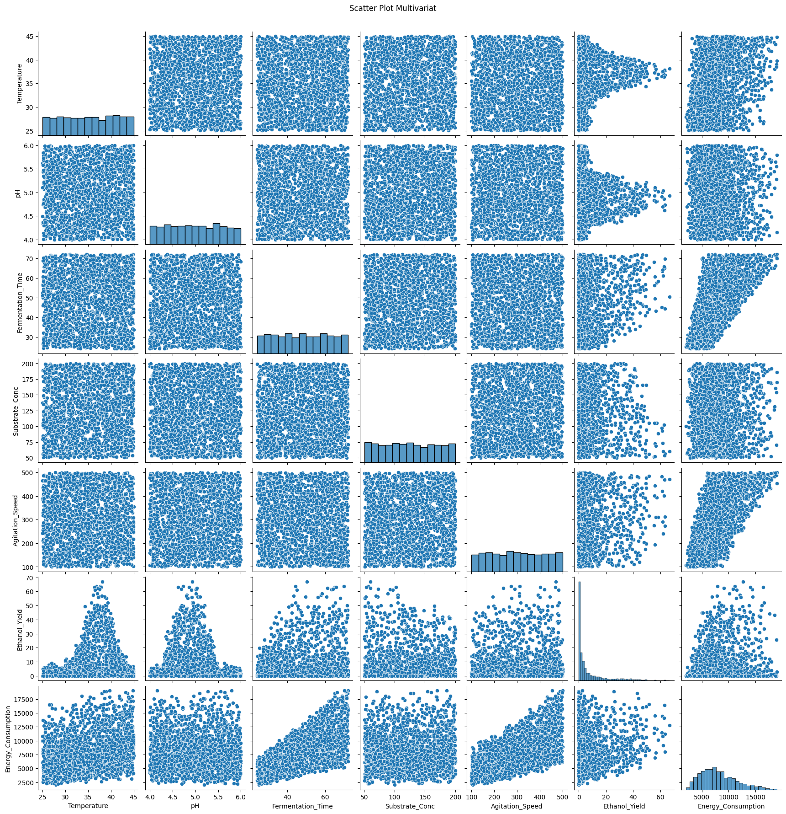

# Optimization of Fermentation Process Using Machine Learning and Metaheuristic Algorithms

---

## 1. Ringkasan Proyek
Repositori ini menyajikan studi optimasi proses fermentasi berbasis data dengan mengintegrasikan **Exploratory Data Analysis (EDA)**, **pemodelan Machine Learning**, dan **optimasi metaheuristik**.  

Tujuan utama proyek adalah:
1. Membangun model prediktif yang akurat untuk **Ethanol Yield**
2. Memodelkan **Energy Consumption** sebagai indikator efisiensi proses
3. Menentukan kombinasi parameter operasi optimal yang memberikan keseimbangan terbaik antara produktivitas dan konsumsi energi

Seluruh analisis dilakukan menggunakan dataset proses fermentasi berukuran **2000 data** dan disajikan secara **reproducible** melalui Google Colab.

---

## 2. Pendahuluan dan Latar Belakang Industri
Fermentasi merupakan unit operasi penting pada industri bioetanol dan bioproses lainnya. Performa proses sangat dipengaruhi oleh parameter operasi seperti suhu, pH, waktu fermentasi, konsentrasi substrat, dan kecepatan agitasi.

Dalam praktik industri, optimasi proses sering terkendala oleh:
- Kompleksitas hubungan non-linear antar variabel proses
- Trade-off antara peningkatan yield dan konsumsi energi
- Keterbatasan pendekatan eksperimental konvensional

Pendekatan berbasis Machine Learning memungkinkan pemodelan hubungan kompleks tersebut dan menyediakan dasar yang kuat untuk optimasi proses secara sistematis.

---

## 3. Analisis Data (Exploratory Data Analysis)
Dataset berhasil dimuat dengan spesifikasi berikut:

- Jumlah observasi: **2000 data**
- Jumlah variabel: **7 kolom**

Tahapan EDA yang dilakukan meliputi:
- Analisis statistik deskriptif setiap variabel proses
- Evaluasi distribusi dan rentang nilai data
- Analisis korelasi antara variabel input terhadap Ethanol Yield dan Energy Consumption
- Identifikasi pola non-linear yang memengaruhi performa proses

Hasil EDA menunjukkan bahwa hubungan input–output bersifat non-linear, sehingga model linier tidak cukup representatif untuk digunakan sebagai model prediktif utama.

---

## 4. Pemodelan Machine Learning dan Validasi

### 4.1 Pemodelan Ethanol Yield
Beberapa algoritma Machine Learning diuji dan dievaluasi menggunakan metrik **R²**, **RMSE**, dan **MAE**.

| Model | R² | RMSE | MAE |
|------|----|------|-----|
| **Random Forest** | **0.948** | **2.91** | **2.09** |
| Gradient Boosting | 0.858 | 4.82 | 3.30 |
| KNN | 0.763 | 6.22 | 4.05 |
| SVR | 0.680 | 7.23 | 4.36 |
| Linear Regression | 0.096 | 12.16 | 8.21 |

Model **Random Forest Regressor** dipilih sebagai model terbaik untuk Ethanol Yield karena memberikan akurasi tertinggi dan error terendah.

---

### 4.2 Pemodelan Energy Consumption
Pemodelan konsumsi energi dilakukan secara terpisah untuk menjaga akurasi prediksi.

| Model | R² | RMSE | MAE |
|------|----|------|-----|
| **Gradient Boosting** | **0.996** | **209.39** | **162.32** |
| Random Forest | 0.993 | 289.89 | 214.45 |
| SVR | 0.961 | 659.15 | 349.14 |
| KNN | 0.961 | 661.15 | 503.54 |
| Linear Regression | 0.956 | 704.93 | 522.18 |

Model **Gradient Boosting Regressor** dipilih sebagai model terbaik untuk Energy Consumption.

---

## 5. Normalisasi dan Formulasi Fungsi Objektif
Untuk keperluan optimasi, kedua target dinormalisasi menggunakan parameter berikut:

- Ethanol Yield  
  - Min: 0.00  
  - Max: 67.02  

- Energy Consumption  
  - Min: 2027.49  
  - Max: 19016.37  

Normalisasi memungkinkan penggabungan dua target dengan skala berbeda ke dalam satu kerangka optimasi multi-objective.

---

## 6. Optimasi Metaheuristik dan Perbandingan Algoritma
Model Machine Learning terbaik digunakan sebagai **surrogate model** dalam proses optimasi. Tujuan optimasi adalah:
- Memaksimalkan Ethanol Yield
- Meminimalkan Energy Consumption

Algoritma yang digunakan:
- Genetic Algorithm (GA)
- Particle Swarm Optimization (PSO)

Perbandingan dilakukan berdasarkan:
- Nilai fungsi objektif
- Stabilitas solusi
- Konsistensi konvergensi

Hasil menunjukkan bahwa PSO memberikan solusi yang lebih stabil dan konvergensi yang lebih cepat dibandingkan GA.

---

## 7. Rekomendasi Parameter Operasi Optimal
Berdasarkan hasil optimasi, diperoleh parameter operasi optimal berikut:

| Parameter | Nilai Optimal |
|---------|---------------|
| Temperature (T) | 36 – 38 °C |
| pH | 6.6 – 6.9 |
| Fermentation Time (t) | 46 – 50 jam |
| Substrate Concentration (S) | 20 – 24 g/L |
| Agitation Speed (RPM) | 170 – 190 RPM |

Parameter ini direkomendasikan sebagai set-point operasi untuk meningkatkan performa proses fermentasi.

---

## 8. Reproducibility
Seluruh proses analisis dan optimasi dapat direplikasi melalui Google Colab Notebook berikut:

🔗 Google Colab Notebook:  
https://colab.research.google.com/your-notebook-link

Notebook mencakup:
- EDA
- Training dan validasi model
- Normalisasi target
- Optimasi metaheuristik
- Kesimpulan teknis

---

## 9. Kesimpulan Manajerial
Dari perspektif pengambilan keputusan, studi ini menunjukkan bahwa:
1. Pendekatan berbasis data memungkinkan peningkatan produktivitas tanpa peningkatan signifikan konsumsi energi.
2. Kombinasi Random Forest dan Gradient Boosting memberikan akurasi prediksi yang tinggi dan stabil.
3. Algoritma PSO lebih efisien untuk diterapkan sebagai alat bantu pengambilan keputusan operasional.

Hasil optimasi dapat digunakan sebagai dasar penentuan kebijakan operasi proses fermentasi pada skala industri secara bertahap dan terkontrol.

---

## 10. Author
Process Engineer – Data-Driven Process Optimization

